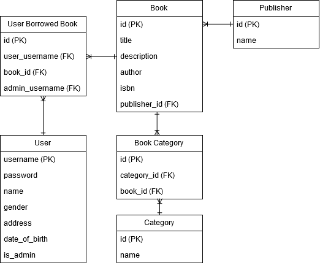

# VLIBS

A library information system written in Visual Basic using Universal Windows Platform (UWP) Form.

This is a final project for Visual Programming (FOC211) course.

## Entity Relationship Diagram

## License

[MIT licensed](LICENSE)
